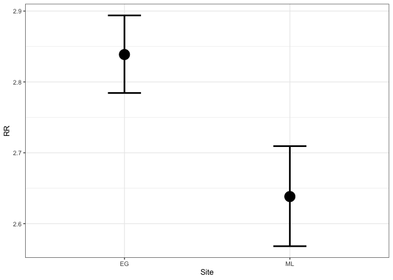
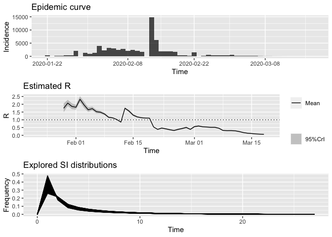
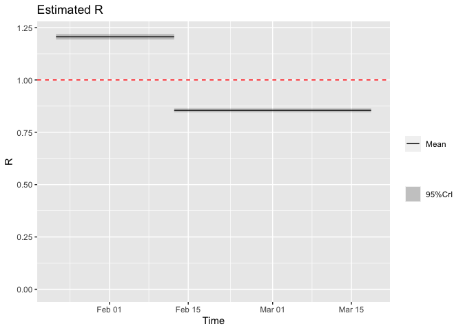
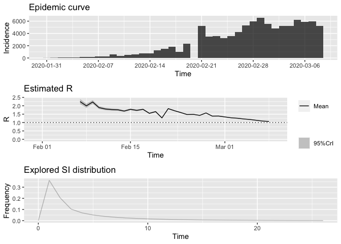
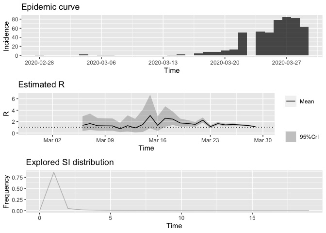
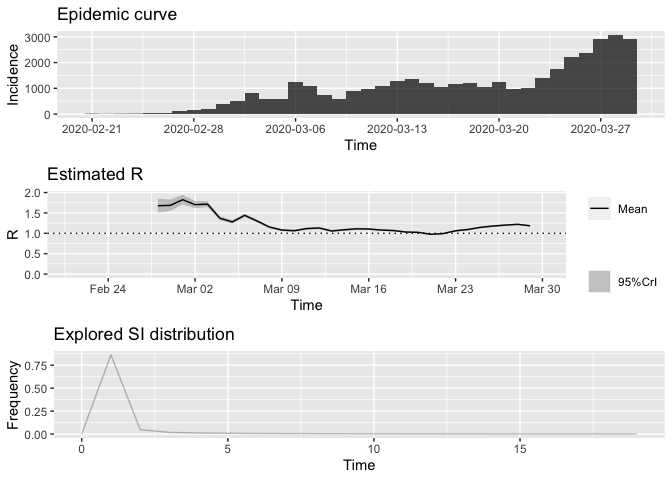
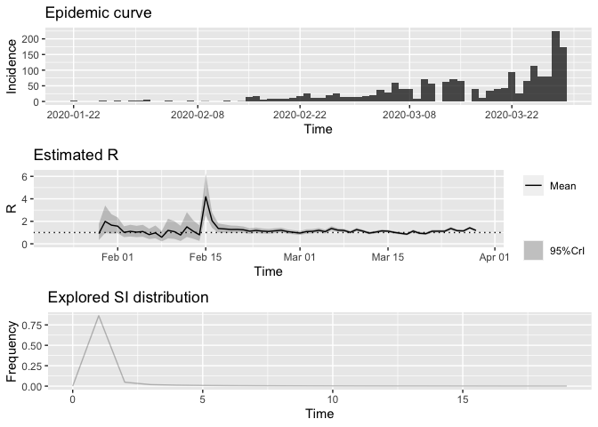

### Attack Rate Method

*R*0 by the attack rate method is given by:
$$ R\_{0} = -\\frac{log(\\frac{1-AR}{S\_{0}})}{AR-(1-S\_{0})} $$
 here *S*<sub>0</sub> is the initial percentage of susceptible
population and *A**R* is eventual percentage of the infected population.
This model assumes homogeneous mixing in the population , no
intervention and a closed population.

### Exponential Growth Method

The exponential growth rate of an outbreak is associated with the
initial reproduction ratio. The exponential growth rate is the per
capita change in the number of cases per time unit. The reproduction
number can be obtained by:
$$ R=\\frac{1}{M(-r)} $$
 where M is the moment generating function of the time generation
function and r is exponential growth rate. The requirement is to
estimate the growth rate from the epidemic curve over the period
exponential growth.

### Maximum likelihood estimation

Estimation of the reproduction number by maximum liklihood estimation
assumes that the number of expected secondary cases produced by a
typical infected individual follows a poisson distribution (with R as
the expected number). The estimate for R is obtained by maximizing the
log-liklihood on a period of exponential growth:
$$ l(R) = \\sum^{T}\_{t=1} log \\left( \\frac{e^{\\mu\_{t}}\\mu\_{t}^{N\_{t}}}{N\_{t!}} \\right) $$
 where N is the number of cases over consecutive time *T*.
*μ*<sub>*t*</sub> is defined as
$\\mu\_{t} = R\\sum\_{i=1}^{t}N\_{t-i}w\_{i}$ *w* is the discretised
time generation distribution.

### Time dependent method

The time dependant method by Wallinga & Teunis reconstructs
probabilistic transmission trees and counts the number infected cases
per infected individual. The reproduction number (Rt) is calculated by
averaging over all cases with same date of onset. The probability that
some case *i* with onset time *t**i* was infected by case *j* with onset
time *t**j* is given by:

$$ p\_{ij} = \\frac{N\_{i}w(t\_{i}-t\_{j})}{\\sum\_{i\\neq k}N\_{i}w(t\_{i}-t\_{k})} $$
 Then $R\_{t} = \\frac{1}{N\_{t}}\\sum\_{\\{tj=t\\}}$, where
*R*<sub>*j*</sub> = ∑<sub>*i*</sub>*p*<sub>*i**j*</sub>.

### Time-varying reproduction number

Hubei
-----

``` r
library(ggplot2)
data.estimates = data.frame(
  var   = c('EG', 'ML'),
  par = c(TD$estimates$EG$R,TD$estimates$ML$R),
  se = c(TD$estimates$EG$conf.int[1],TD$estimates$ML$conf.int[1]),
  eq = c(TD$estimates$EG$conf.int[2], TD$estimates$ML$conf.int[2]))

p2 <- ggplot(data.estimates, aes(var,par, size=10)) + theme_bw(base_size=10)
p2 + geom_point() +geom_errorbar(aes(x = var, ymin = eq, ymax = se, size=2), width = 0.2) + xlab("Site") + ylab("RR") + theme(legend.position = "none")
```





``` r
library(ggplot2)
t_start <- c(2, 23)
t_end <- c(22, 57)

closure_hubei_parametric_si <- estimate_R(hubei, 
                               method = "parametric_si",
                            config = make_config(list(
                            t_start = t_start,
                            t_end = t_end,
                            mean_si = 3.96, 
                            std_si = 4.75)))
plot(closure_hubei_parametric_si, "R") +
  geom_hline(aes(yintercept = 1), color = "red", lty = 2)
```



Italy
-----



New Zealand
-----------



Iran
----



Japan
-----


